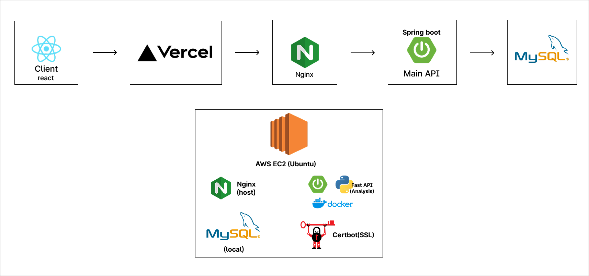
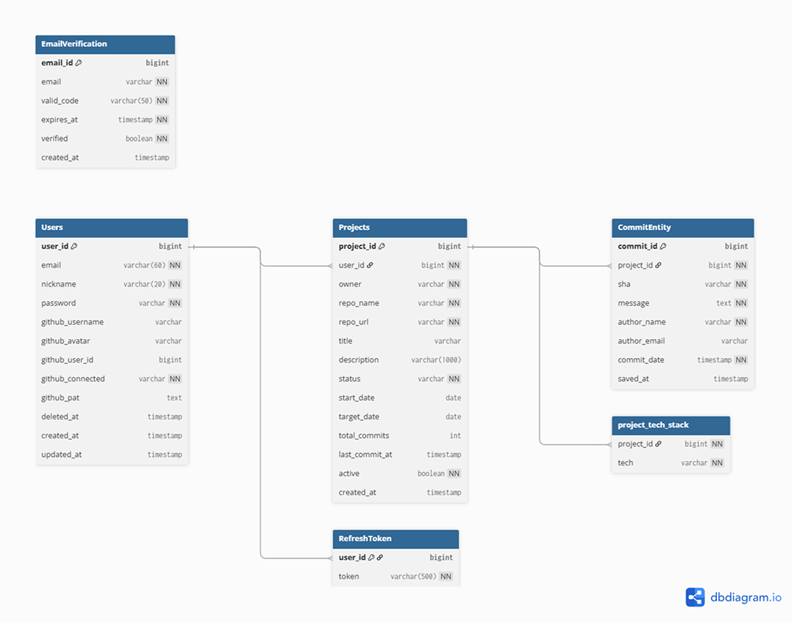

# 📌 프로젝트 개요
GitHub 커밋 기반 사이드 프로젝트 트래커  
개발자의 프로젝트 진행 현황을 커밋 데이터로 시각화하고 관리하는 서비스

---

## 배포 주소

---

## 팀 소개
<table>
  <tr>
    <th align="left">Role</th>
    <th align="left">Member</th>
  </tr>
  <tr>
    <td>Frontend</td>
    <td>
      <a href="https://github.com/MA-Ha-eun">
        
        <strong> 마하은</strong>
      </a>
    </td>
  </tr>
  <tr>
    <td>Backend</td>
    <td>
      <a href="https://github.com/simuneu">
        
        <strong> 박시현</strong>
      </a>
    </td>
  </tr>
</table>

---

## 화면 미리보기

---

## 주요 기능

---

## 기술 스택
### Frontend

### Backend

### Infrastructure

---

## 시스템 / 배포 아키텍처

---

## ERD

---

## API 문서
- [API Documentation](./api.md)
